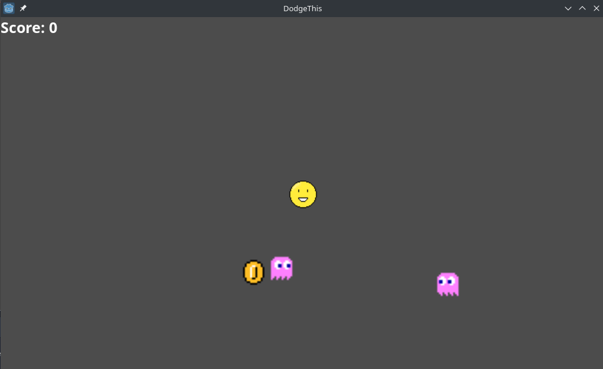
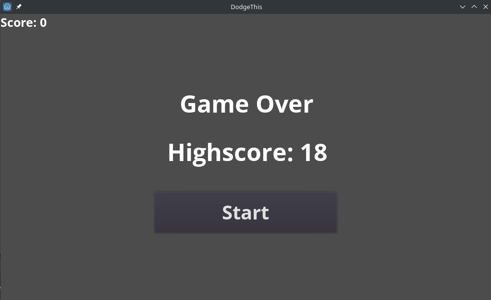

# DodgeThis
> Simple godot game about dodging the ubiquitous enemies

## Table of contents
* [General info](#general-info)
* [Screenshots](#screenshots)
* [Technologies](#technologies)
* [Features](#features)
* [Status](#status)

## General info
I am making this game just for practising. I like creating something from nothing and designing my own worlds. This is very
early step on my way to making more advanced games.

## Screenshots

## Technologies
* Godot v3.1

## Features
List of features ready and TODOs for future development
* Boss after 1 min of playing
* New enemies (rare ones)
* Difficulty levels

## Status
Project is: _in progress_
